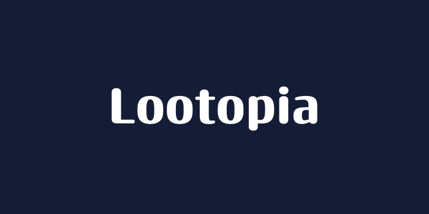
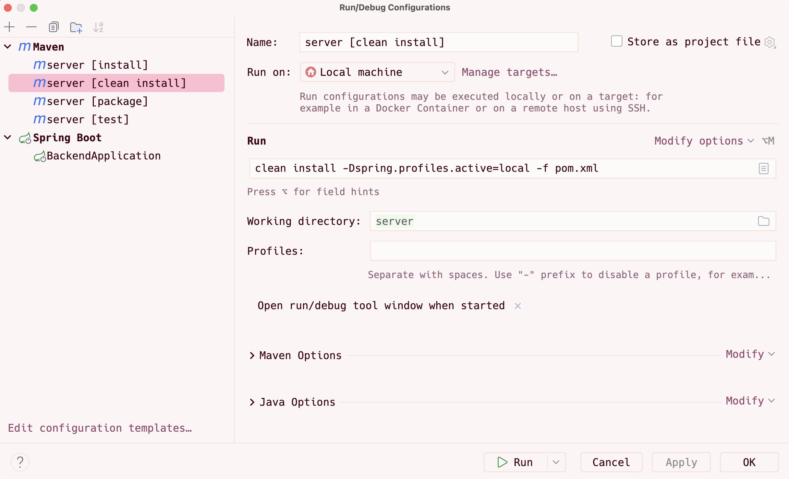
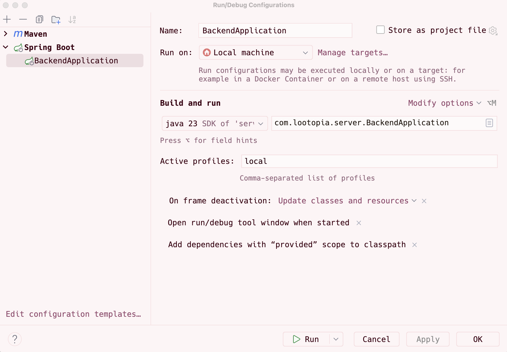

[](https://img.shields.io/github/v/release/adammehdaoui/lootopia?include_prereleases)
[](https://img.shields.io/github/last-commit/adammehdaoui/lootopia)
[](https://img.shields.io/github/issues-raw/adammehdaoui/lootopia)
[](https://img.shields.io/github/issues-pr/adammehdaoui/lootopia)
[](https://img.shields.io/github/license/adammehdaoui/lootopia)

# Running the project (for developers)

Prerequisites:

- [Node.js](https://nodejs.org/en/download/) (v18 or later)
- [Java](https://www.oracle.com/java/technologies/javase-jdk11-downloads.html) (v21 or later, we usually use the microsoft build)
- [Maven](https://maven.apache.org/download.cgi) (v3.9.9 or later)
- [Docker](https://www.docker.com/products/docker-desktop) (v28.1.1 or later)
- [IntelliJ IDEA](https://www.jetbrains.com/idea/download/) (v2025.1 or later)
- [Xcode](https://code.visualstudio.com/download) (v16.3 or later, optional for frontend development)

# Running the database

To run the database, you need to have Docker installed. Once you have Docker set up, you can run the following command to start the SQL Server container:

```sh
docker compose up -d
```

Once the container is running, you can connect to the database using the following command:

```sh
/opt/mssql-tools18/bin/sqlcmd -S localhost -U sa -P YourStrong!Passw0rd -C
```

# Running the backend

You need to create your own `application-local.yml` file in the `server/src/main/resources` directory. You can use the `application-local.example.yml` file as a template.
Make sure to set the correct database connection properties.
You will need to ask current developers for the database, blob storage connections properties, as they are not included in the repository for security reasons.

To run the backend, you need to have Java and Maven installed. Once you have them set up, open IntelliJ IDEA and import the project as a Maven project. After that, you can install the required dependencies by running the following command in the terminal:



Then you can run the backend using the following configuration in IntelliJ IDEA:



# Running the frontend (web application)

Before running the frontend, create a `.env` file in the `client-web` directory. You can use the `.env.example` file as a template to test app quickly.

To run the frontend, you need to have Node.js installed. Once you have it set up, navigate to the `client-web` directory in your terminal and run the following commands:

```sh
npm install
npm run dev
```

# Running the mobile application (mobile application)

To run the mobile application, you need to have Node.js and Xcode installed. Once you have them set up, navigate to the `client-mobile` directory in your terminal and run the following commands:

```sh
npm run build
```

It will build the mobile application and generate the necessary files. After that, open Xcode and open the `client-mobile/ios` directory as a project. Then configure your iPhone as the target device.
Then run the following command in the terminal and select your iPhone device to start the Expo app:

```sh
npm run ios-device
```

# Troubleshooting

If you encounter any issues while running the project, go to the troubleshooting folder in the repository. There you will find solutions to common problems that developers face when running the project.

# Contributors

<a href="https://github.com/adammehdaoui">
  
  <br>
  <b>Adam Mehdaoui</b>
</a>

<br>
<br>

<a href="https://github.com/louislagrange1">
  
  <br>
  <b>Louis Lagrange</b>
</a>
